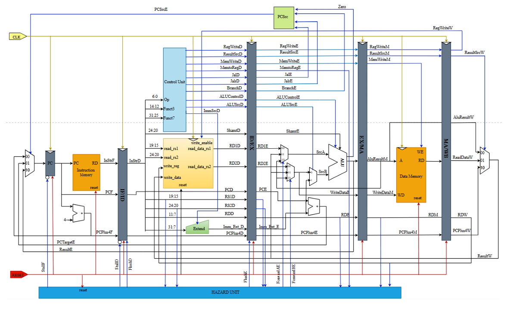

  RISC-V 32-bit Pipelined Core (RV32I)
  [](https://opensource.org/licenses/MIT)
  []()
  []()
  []()
  []()

  A high-performance, synthesizable **5-stage pipelined RISC-V 32-bit processor core** implementing the RV32I base integer instruction set. Built with modular Verilog HDL adhering to Harvard architecture with decoupled instruction and data memories.
  
  ---

## Key Features

* **ISA Standard:** Full execution support for RV32I Base Integer Instruction Set architecture.
* **Pipeline Microarchitecture:** Classic 5-stage pipeline (`Fetch`, `Decode`, `Execute`, `Memory`, `Writeback`).
* **Advanced Hazard Handling:**
  * **Data Forwarding Unit:** Dynamic forwarding (`EX->EX`, `MEM->EX`) to resolve Read-After-Write (RAW) hazards with zero latency penalty.
  * **Load-Use Stall Unit:** Automatic single-cycle bubble insertion for unresolved load dependencies.
  * **Control Hazard Resolution:** Flush mechanism on branch/jump control instruction redirects.
* **Harvard Architecture:** Decoupled Instruction Memory and Data Memory interfaces to eliminate structural hazards.
* **Design Methodology:** Fully synchronous, synthesizable RTL without vendor-specific primitives.

---

## Target Architecture & Synthesis

* **Target Devices:** FPGA (Xilinx Artix-7 / Intel Cyclone IV) or ASIC front-end flow.
* **Design Style:** Fully synchronous, highly modular Verilog HDL code base.

---

## Architecture Diagram


## Project Structure

```text
RISCV_PIPELINE_CORE/
│
├── docs/
├── src/
│   ├── Alu_Decoder.v
│   ├── ALU.v
│   ├── Control_Unit_top.v
│   ├── Data_Memory.v
│   ├── Decode_Cycle.v
│   ├── Decode_Cycle_tb.v
│   ├── Execute_Cycle.v
│   ├── Execute_Cycle_tb.v
│   ├── Fetch_Cycle.v
│   ├── Fetch_Cycle_tb.v
│   ├── Hazard_Unit.v
│   ├── ID_EX_Register.v
│   ├── IF_ID_Register.v
│   ├── Instruction_Memory.v
│   ├── Main_Decoder.v
│   ├── Memory_Cycle.v
│   ├── Memory_Cycle_tb.v
│   ├── Mux_Fetch.v
│   ├── PC.v
│   ├── PC_Adder.v
│   ├── Pipeline_top.v
│   ├── pipeline_tb.v
│   ├── Register_File.v
│   ├── Sign_Extend.v
│   ├── Write_Back.v
│   └── Write_Back_tb.v
│
├── .gitignore
├── filelist.f
└── README.md
```

## Pipeline Microarchitecture & Datapath Stages

The processor breaks down instruction execution into 5 distinct pipeline stages:

### 1. Instruction Fetch (IF)
* Managed by the PC counter and instruction memory.
* Incorporates a 3-to-1 multiplexer controlled by `PCSrcE` to handle sequential execution (PC + 4), branch target addresses (`PCTargetE`), and jump targets (`ResultE`).
* Uses `IF/ID` pipeline registers alongside `enableF`, `enableD`, and `clearD` signals for hazard stall/flush control.


### 2. Instruction Decode (ID)
* Decodes instructions using the Main Control Unit and ALU Decoder based on `opcode`, `funct3`, and `funct7`.
* Features a 32 x 32-bit register file (rs1, rs2, rd) and an `ImmExt` module supporting I, S, B, and J type immediate expansions.


### 3. Execute (EX)
* Performs arithmetic and logic operations using the main ALU.
* Includes Forwarding Logic (`ForwardAE`, `ForwardBE`) to resolve Read-After-Write (RAW) data hazards dynamically from the MEM and WB stages.
* Computes branch conditions and generates target addresses.

### 4. Memory Access (MEM)
* Interfaces with the Data Memory (`Data_Memory`) supporting load and store operations.
* Passes data and control signals through the `MA/WB` registers.

### 5. Writeback (WB)
* Selects the final writeback data via `ResultSrcW` (ALU result, Data memory read, or PC + 4) to update the destination register.

---

## Hazard Detection & Forwarding (NVIDIA-grade Design Highlights)

### Data Hazard Resolution (Forwarding & Stalling)
* **ALU Forwarding:** The `Hazard_Unit` compares source registers (`RS1E`, `RS2E`) with previous destination registers (`RDM`, `RDW`). If a match occurs, `ForwardAE`/`ForwardBE` switches to `2'b10` (EX/MEM forwarding) or `2'b01` (MEM/WB forwarding).
* **Load-Use Hazards:** Detected when an instruction immediately following a load instruction attempts to read the loaded register (`RS1D/RS2D == RDE` and `MemtoRegE == 1`). The unit pulls `StallF` and `StallD` low and flushes the pipeline stage to introduce a bubble safely.

## Control Unit & Instruction Encoding Summary

| Instruction Type | Opcode | RegWrite | ImmSrc | ALUSrc | MemWrite | ResultSrc | Branch | Jal | Jalr | ALUOp |
| :--- | :---: | :---: | :---: | :---: | :---: | :---: | :---: | :---: | :---: | :---: |
| **I-Type (Loads)** | `0000011` | 1 | `00` | 1 | 0 | 01 | 0 | 0 | 0 | `00` |
| **S-Type (Stores)** | `0100011` | 0 | `01` | 1 | 1 | 00 | 0 | 0 | 0 | `00` |
| **B-Type (Branch)** | `1100011` | 0 | `10` | 0 | 0 | 00 | 1 | 0 | 0 | `01` |
| **J-Type (Jump and Link Reg)** | `1100111` | 1 | `00` | 1 | 0 | 10 | 1 | 0 | 1 | `01` |
| **I-Type (Arithmetic)** | `0010011` | 1 | `00` | 1 | 0 | 0 | 0 | 0 | 0 | `10` |
| **R-Type (Arithmetic)** | `0110011` | 1 | `xx` | 0 | 0 | 0 | 0 | 0 | 0 | `10` |
| **I-Type (Shift imm)** | `0010011` | 1 | `xx` | x | 0 | 0 | 0 | 0 | 0 | `10` |
| **J-type (Jump and link)** | `1101111` | 1 | `11` | `x` | 0 | 10 | 0 | 1 | 0 | `11` |

---

## Getting Started & Simulation

### Prerequisites
- HDL Simulator supporting Verilog/SystemVerilog (e.g., Vivado, QuestaSim, ModelSim, or Verilator).
- RISC-V GNU Toolchain (optional, for compiling custom assembly/C test vectors).

## Simulation & Verification Setup

### Prerequisites
* **HDL Simulator:** Icarus Verilog / ModelSim / QuestaSim / Xilinx Vivado / Verilator
* **Toolchain (Optional):** RISC-V GNU Toolchain (for compiling C/Assembly test vectors)

### Verification Methodology
* **Unit Testing:** Individual pipeline stages (`Fetch`, `Decode`, `Execute`, `Memory`, `Writeback`) are verified via dedicated testbenches (`*_tb.v`).
* **Integration Testing:** Full-system pipeline verification is performed using `pipeline_tb.v` with test vectors validating data forwarding, load-use hazard stalls, and branch control flushes.

---

### Running Simulation (CLI Flow via Icarus Verilog)

```bash
# Clone the repository
git clone https://github.com/quanghieuzrz/RISCV_Pipeline_Core.git
cd RISCV_Pipeline_Core

# Compile RTL and Testbench using filelist
iverilog -g2012 -f filelist.f -o sim_out.vvp

# Run simulation
vvp sim_out.vvp

# Open Waveform via GTKWave
gtkwave waveform.vcd
```

---

## Current Limitations

This project is an educational and synthesizable core focused on core pipeline fundamentals:

* **Supported Set:** Currently implements a functional subset of RV32I base instructions.
* **Exceptions/Interrupts:** No trap handling, CSR registers, or exception logic integrated yet.
* **Memory System:** Uses flat memory arrays without L1 Instruction/Data Cache integration.
* **Branch Prediction:** Uses basic branch flush mechanism without dynamic branch predictors.

---

## Future Enhancements

- [ ] Complete full RV32I instruction extensions (`LUI`, `AUIPC`, `SLTI`, `SRA`, etc.).
- [ ] Implement Dynamic Branch Target Buffer (BTB) & Branch Predictor.
- [ ] Integrate Harvard L1 Caches (I-Cache & D-Cache).
- [ ] Add AXI4-Lite Memory-Mapped Bus interface for SoC integration.
- [ ] Synthesize design on Xilinx Artix-7 FPGA and report PPA metrics (Power, Performance, Area).

---

## Author

**Hieu Bui**
* 💼 **LinkedIn:** [quanghieuzrz](https://www.linkedin.com/in/quanghieuzrz/)
* ✉️ **Email:** hieubuiquang2006@gmail.com
* 📞 **Phone:** (+84) 868677412
